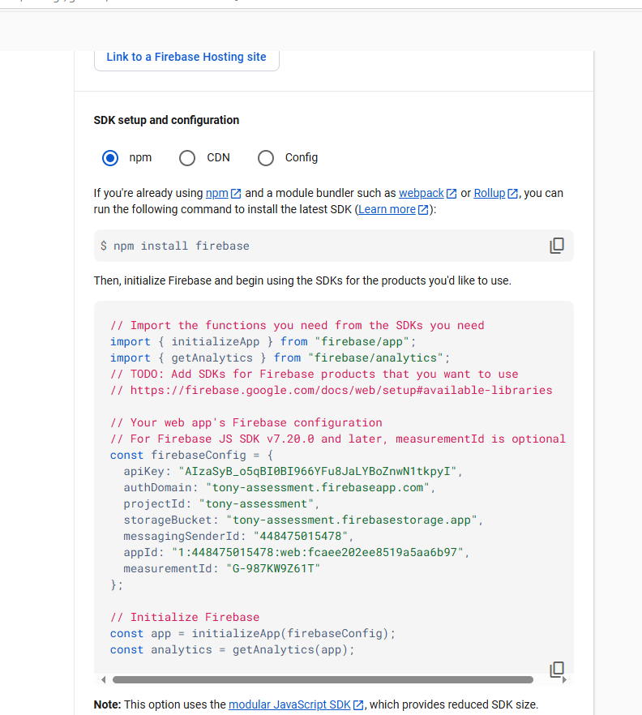

This is a [Next.js](https://nextjs.org) project bootstrapped with [`create-next-app`](https://nextjs.org/docs/app/api-reference/cli/create-next-app).

## Getting Started

before installing node_modules be sure to add your firebase configuration from firebase, this will setup the particular api keys needed to view and edit users

login to [firebase](https://console.firebase.google.com/) and navigate to your project settings:
it should look something like this



Once you have your copy of your credentials create a file called .env.local and add it to the base of your route and add the config there.

First, run the development server:

```bash
npm run install
npm run dev
```

Open [http://localhost:3000](http://localhost:3000) with your browser to see the result.

You can login with a number of accounts:
  - email: tony@email.com
  - email: tony@tones.com
  - email: toasty@toast.com
  - password: 123123

## Learn More

To learn more about Next.js, take a look at the following resources:

- [Next.js Documentation](https://nextjs.org/docs) - learn about Next.js features and API.
- [Learn Next.js](https://nextjs.org/learn) - an interactive Next.js tutorial.

You can check out [the Next.js GitHub repository](https://github.com/vercel/next.js) - your feedback and contributions are welcome!


